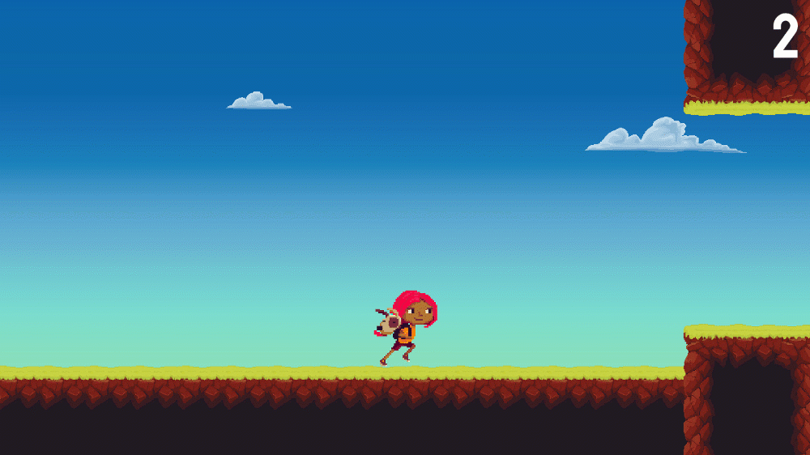

# ⚡ Unity Bolt Samples

A collection of Unity packages featuring Bolt Visual Scripting samples. Each sample demonstrates how to work with Unity editor features, game logic, &amp; more without having to write a single line of code. **All samples can be found in this repo's [Releases section](https://github.com/avashly/Unity-BoltKit-Samples/releases).**

[Setup](#setup) | [Samples](#samples)
------------ | ------------- | -------------

**NOTE:** 
- If you grab the project files directly instead of the .unitypackage, you may need to restart the editor after opening the project.

 

  

## Setup

The easiest way to get started:

1. Download the most recent version of the Unity Bolt Samples from the [Releases section](https://github.com/avashly/Unity-BoltKit-Samples/releases).

2. Use the [Unity Hub](https://docs.unity3d.com/Manual/GettingStartedInstallingHub.html) to open a new Unity 2019.4.17f1 LTS or 2020.1 project using the Universal Render Pipeline template.

3. In the menu bar, navigate to Assets > Import Package > Custom Package & select the package you downloaded earlier to import it into your project.

4. Accept the prompts from the Bolt installer that appear and use the default settings. After this, you're all set!

 

## Samples

### Working with Shader Graph, Materials, & More

Includes samples for working with Shader Graph, materials, keyboard input, colliders / triggers, game object tags, & scene management. Additional documentation coming soon. The sample Bolt macros can be found within BoltKit_ThirdPerson_Samples > Macros. [Get the project package + setup / requirements here.](https://github.com/avashly/Unity-Bolt-Samples/releases/tag/v1.0)

 

### Endless Runner Game

A basic example of a 2D endless runner game that uses flow graphs & state graphs. Includes Bolt graphs that handle basic physics, scoring, UI updates, & animations. Bolt macro graphs are located within BoltSamples_2_EndlessRunner > Macros. Additional Bolt embed graphs are on the Game Manager object in the EndlessRunner scene. 
 
[Get the project package + setup / requirements here.](https://github.com/avashly/Unity-Bolt-Samples/releases/tag/v1.0)&nbsp;&nbsp;|&nbsp;&nbsp;Watch the video tutorial [here](https://youtu.be/DtbyC1OBpFg).

 

### Market Demo (Visual Scripting for Artists & Designers)

A more advanced demo featuring Bolt graphs for UI / dialouge, handling audio & animations, third person controls, scene management, working with Timeline, and more. 
 
[Get the project package + setup / requirements here.](https://github.com/avashly/Unity-Bolt-Samples/releases/tag/Demo-2.2)&nbsp;&nbsp;|&nbsp;&nbsp;Watch the video tutorial [here](https://youtu.be/Q0aXoLPK7tM).

 

### Space Demo (Visual Scripting for Programmers)

A demo showing how to use C# scripts with Bolt. Feautres examples for using / customizing C# functions within visual scripting graphs, custom unit creation, accessing Bolt events & variables in C# scripts, & more. 
 
[Get the project package + setup / requirements here.](https://github.com/avashly/Unity-Bolt-Samples/releases/tag/Space-V1)&nbsp;&nbsp;|&nbsp;&nbsp;Watch the video tutorial [here](https://resources.unity.com/unitenow/onlinesessions/visual-scripting-for-programmers-prototyping-team-tools).
